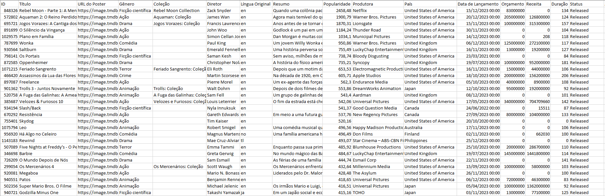
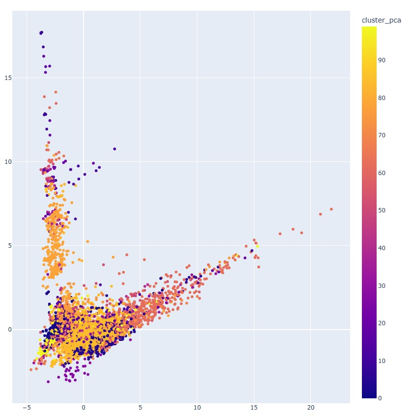
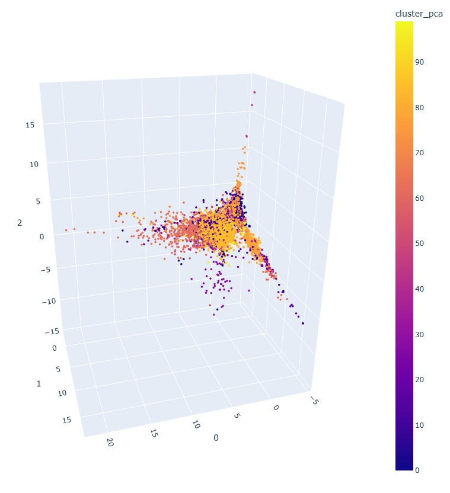
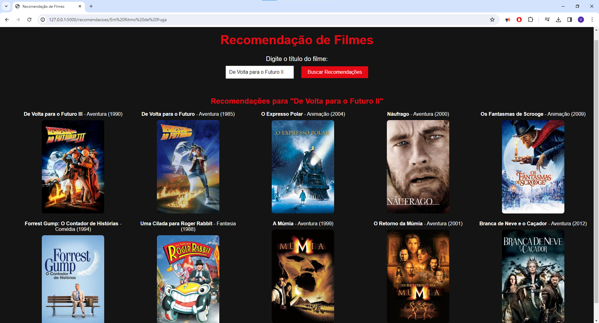
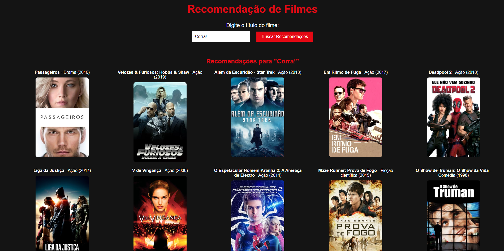

# Recomendador de Filmes :movie_camera:

Repositório criado para o desenvolvimento de um sistema de **Recomendação de Filmes** com *K-Means*.

A ideia desse projeto surgiu após a realização do curso *"Clustering aplicado: recomendando músicas com K-Means"*, realizado na Alura e ministrado pela Sthefanie Monica Premebida.

Ao longo do curso, foi desenvolvido um sistema de recomedação de música utilizando a *API do Spotify*. Foram explicados os métodos de **Machine Learning** não supervisionada para classificação, quais critérios e características das músicas são utilizadas e como aplicar as bibliotecas do ***sklearn*** para se clusterizar os dados.

Baseado nesse projeto, tomei a iniciativa de aplicar esses conceitos na criação de um **Recomendador de Filmes**. 

## Extração dos dados :floppy_disk:

Iniciei exportando a base de dados a partir da [API The Movie DataBase](https://www.themoviedb.org), da qual pude extrair e tratar aproximadamente 10 mil filmes. Entre as informações obtidas, estão o Id, Título, URL do Poster, Gênero, Coleção, Diretor, Língua Original, Resumo, Popularidade, Produtora, País, Data de Lançamento, Orçamento, Receita, Duração, Status, Avaliação Média e Quantidade de Avaliações.

## Tratamento dos dados :bar_chart:

Uma vez com esses dados extraídos e salvos em uma base própria, foi iniciado o processo de tratamento dos dados para sua aplicação no modelo. Nessa etapa foram removidas as colunas que não impactam na análise (como Título e URL do Poster), preenchidos os valores nulos de algumas colunas (Como coleção ou Produtora), corrigida a formatação numérica dos valores e criadas colunas adicionais que auxiliariam o modelo a convergir com maior assertividade com o auxílio do preprocessador *OneHotEncoder* para fragmentação dos dados. 

## Padronização e Clusterização :open_file_folder:

Em seguida, foi gerado a projection dos dados a partir de um pipeline pca obtido valendo-se da ferramenta **StandardScaler**. Foram gerados assim **100 clusters**, dividindo os filmes em diferentes grupos. A explicabilidade do pipeline foi de 70,112%, englobando 548 componentes.

> Plotagem das duas dimensões mais significativas ao modelo

> Plotagem das três dimensões mais significativas ao modelo

Com essa divisão, utilizando a distância euclidiana entre os pontos, fez-se possível definir aqueles mais próximos, sendo assim os recomendados. 

## Interface Web :computer:

Por fim, foi criada uma interface utilizando o framework **flask** para que o usuário possa interagir com o sistema, pesquisando por filmes e vendo as sugestões obtidas!

### Recomendações para o filme De Volta para o Futuro 2 :car:

### Recomendações para o filme O Castelo Animado :european_castle:

### Recomendações para o filme Corra! :runner:

